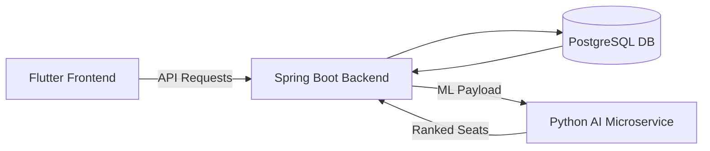

# SeatSurfer 🪑🚀  
**AI-Powered Seat Management System for Hybrid Workplaces**

[](LICENSE)  
[]()  
[](#demo)

---

## 🧠 Overview

**SeatSurfer** is a full-stack, AI-powered platform for dynamic office seat reservation. Designed to address the real-world challenges of hybrid workspaces, it enables:

- Real-time seat booking and floor plan visualization
- AI-driven seat recommendations personalized per user
- Scalable, secure, and multi-tenant backend infrastructure
- Responsive UI across desktop and mobile devices

This project was developed as part of a **Bachelor Thesis** and simulates enterprise-grade architecture with a strong emphasis on modularity, maintainability, and data-driven design.

---

## 🔧 Architecture



- **Frontend:** Flutter (cross-platform UI)
- **Backend:** Spring Boot + Spring Security + REST API
- **Database:** PostgreSQL (3NF normalized schema)
- **ML Engine:** Python Flask microservice (collaborative filtering)

---

## 📦 Features

### 🧍‍♂️ For Users
- Book and cancel seats in real-time
- View floor layouts dynamically
- Get smart seat recommendations
- Mobile and desktop support

### 🧑‍💼 For Admins
- Manage users, floors, and layouts
- Visualize booking stats
- Multi-tenant control with scoped access

### 🔍 AI Module
- Learns from user preferences and historical booking data
- Uses spatial heuristics and behavioral clustering
- Ranks seat options in real-time via HTTP API

---

## 📊 Results

A simulated study with **200 users over 30 days** showed:

| Metric                        | Without AI | With AI    | Δ Improvement |
|------------------------------|------------|------------|----------------|
| Booking Time (avg)           | 14.2 sec   | **6.7 sec** | 2.1× faster    |
| Top-3 Suggestion Acceptance  | –          | **91%**     | —              |
| Seat Clustering              | High       | **↓28%**    | Less congestion|
| Satisfaction Score (1–5)     | 3.3        | **4.5**     | ↑ +1.2         |

---

## 🚀 Demo

### User Flow (GIFs/Screenshots)
> Add animated GIFs or screenshots from mobile and web interfaces here

---

## 🔐 Security Highlights

- Role-based access control (Spring Security + JWT)
- Tenant-aware data isolation
- Field-level validation and error handling
- Prepared statements and ORM to prevent SQL injection
- Planned: OAuth2, schema-per-tenant support, encryption at rest

---

## 📁 Project Structure

```bash
SeatSurfer/
│
├── backend/              # Spring Boot application
│   ├── src/main/java
│   ├── resources/
│   └── pom.xml
│
├── frontend/             # Flutter mobile/web app
│   ├── lib/
│   └── pubspec.yaml
│
├── ai-microservice/      # Python seat recommender
│   ├── app.py
│   └── recommender.py
│
└── docs/                 # Diagrams, reports, research
```

---

## 🧪 Testing

- **Backend:** JUnit + Mockito for unit and integration tests
- **Frontend:** Widget tests + manual user flow validation
- **AI Module:** Evaluation on synthetic + real datasets

---

## 🧠 Technologies

| Layer       | Tech Stack                     |
|-------------|---------------------------------|
| Frontend    | Flutter, Dart, Material Design |
| Backend     | Spring Boot, REST, PostgreSQL  |
| ML Engine   | Python, Flask, Pandas, NumPy   |
| Security    | Spring Security, JWT           |
| DevOps      | Git, Docker (planned), CI-ready|

---

## 📚 Academic Context

This project was developed as part of my **Bachelor Thesis** at  
**Faculty of Mathematics and Computer Science – Babeș-Bolyai University**  
Supervisor: *Lecturer PhD Emilia-Loredana Pop*

> A research paper based on SeatSurfer was submitted to the university’s academic conference and reviewed by Studia Informatica.

---

## 🎯 Future Work

- 🔗 Integrate real-time IoT occupancy sensors
- 🧠 Upgrade ML module to reinforcement learning
- 👥 Team-aware and sustainability-aware seating logic
- ☁️ Cloud deployment (Docker + CI/CD)
- 📊 Admin analytics dashboard with historical trends

---

## 🤝 Contributing

Contributions, suggestions, or forks are welcome.

To contribute:

1. Fork the repository
2. Clone it locally: `git clone https://github.com/youruser/SeatSurfer.git`
3. Create your feature branch: `git checkout -b feature/amazing-feature`
4. Commit your changes: `git commit -m "Added amazing feature"`
5. Push to the branch: `git push origin feature/amazing-feature`
6. Create a Pull Request

---

## 📄 License

This project is licensed under the **MIT License**. See the [LICENSE](./LICENSE) file for details.

---

## 🙋‍♂️ Contact

**Radu-Matei Prodan**  
Email: `mateiprodan1@gmail.com`  
LinkedIn: [linkedin.com/matei-prodan](https://www.linkedin.com/in/matei-prodan-7624341a4/)

---
