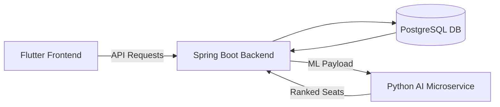

# SeatSurfer 🪑🚀  
**AI-Powered Seat Management System for Hybrid Workplaces**

[](LICENSE)  
[]()  
[](#demo)

---

## 🧠 Overview

**SeatSurfer** is a full-stack, AI-powered platform for dynamic office seat reservation. Designed to address the real-world challenges of hybrid workspaces, it enables:

- Real-time seat booking and floor plan visualization
- AI-driven seat recommendations personalized per user
- Scalable, secure, and multi-tenant backend infrastructure
- Responsive UI across desktop and mobile devices

This project was developed as part of a **Bachelor Thesis** and simulates enterprise-grade architecture with a strong emphasis on modularity, maintainability, and data-driven design.

---

## 🔧 Architecture



- **Frontend:** Flutter (cross-platform UI)
- **Backend:** Spring Boot + Spring Security + REST API
- **Database:** PostgreSQL (3NF normalized schema)
- **ML Engine:** Python Flask microservice (collaborative filtering)

---

## 📦 Features

### 🧍‍♂️ For Users
- Book and cancel seats in real-time
- View floor layouts dynamically
- Get smart seat recommendations
- Mobile and desktop support

### 🧑‍💼 For Admins
- Manage users, floors, and layouts
- Visualize booking stats
- Multi-tenant control with scoped access

### 🔍 AI Module
- Learns from user preferences and historical booking data
- Uses spatial heuristics and behavioral clustering
- Ranks seat options in real-time via HTTP API

---

## 📊 Results

A simulated study with **200 users over 30 days** showed:

| Metric                        | Without AI | With AI    | Δ Improvement |
|------------------------------|------------|------------|----------------|
| Booking Time (avg)           | 14.2 sec   | **6.7 sec** | 2.1× faster    |
| Top-3 Suggestion Acceptance  | –          | **91%**     | —              |
| Seat Clustering              | High       | **↓28%**    | Less congestion|
| Satisfaction Score (1–5)     | 3.3        | **4.5**     | ↑ +1.2         |

---

## 🚀 Demo

### 🔐 1. Login / Sign Up Screen


This screen allows new users to sign up or existing users to sign in securely. Inputs are validated before submission.


### 🗺️ 2. Seat Availability by Floor


Users can view the layout of a selected storey, see which seats are occupied (red), and which are available (grey).


### 📅 3. Upcoming Bookings


All future seat reservations are listed in chronological order. Each card provides quick access to details and allows deletion.


### 🏢 4. Buildings and Storeys Admin View


Admins can manage buildings and associated storeys in a structured view. Each entry links to occupancy statistics.


### 📊 5. Occupancy Statistics for a Storey


Users can select a date range to view total seats, how many are booked or unbooked, and the occupancy percentage.


### 🎨 6. Admin Layout Configuration


Admins can design custom seat layouts by clicking to toggle seat availability. Supports flexible space planning.


### 🔎 7. Booking Details Modal


When clicking on a booking, users get additional details: seat row, column, and storey name — improving clarity.


### 🕓 8. Past and Upcoming Bookings


All bookings are categorized into upcoming and past ones. Users can track their history and manage future reservations.


### 🤖 AI-Powered Seat Suggestion


SeatSurfer includes an AI recommendation engine that suggests the best available seats based on historical booking data, preferred zones, and spatial distribution. This feature reduces decision fatigue and helps optimize occupancy across office layouts.

---

## 🔐 Security Highlights

- Role-based access control (Spring Security + JWT)
- Tenant-aware data isolation
- Field-level validation and error handling
- Prepared statements and ORM to prevent SQL injection
- Planned: OAuth2, schema-per-tenant support, encryption at rest

---

## 📁 Project Structure

```bash
SeatSurfer/
│
├── backend/              # Spring Boot application
│   ├── src/main/java
│   ├── resources/
│   └── pom.xml
│
├── frontend/             # Flutter mobile/web app
│   ├── lib/
│   └── pubspec.yaml
│
├── ai-microservice/      # Python seat recommender
│   ├── app.py
│   └── recommender.py
│
└── docs/                 # Diagrams, reports, research
```

---

## 🧪 Testing

- **Backend:** JUnit + Mockito for unit and integration tests
- **Frontend:** Widget tests + manual user flow validation
- **AI Module:** Evaluation on synthetic + real datasets

---

## 🧠 Technologies

| Layer       | Tech Stack                     |
|-------------|---------------------------------|
| Frontend    | Flutter, Dart, Material Design |
| Backend     | Spring Boot, REST, PostgreSQL  |
| ML Engine   | Python, Flask, Pandas, NumPy   |
| Security    | Spring Security, JWT           |
| DevOps      | Git, Docker (planned), CI-ready|

---

## 📚 Academic Context

This project was developed as part of my **Bachelor Thesis** at  
**Faculty of Mathematics and Computer Science – Babeș-Bolyai University**  
Supervisor: *Lecturer PhD Emilia-Loredana Pop*

> A research paper based on SeatSurfer was submitted to the university’s academic conference and reviewed by Studia Informatica.

---

## 🎯 Future Work

- 🔗 Integrate real-time IoT occupancy sensors
- 🧠 Upgrade ML module to reinforcement learning
- 👥 Team-aware and sustainability-aware seating logic
- ☁️ Cloud deployment (Docker + CI/CD)
- 📊 Admin analytics dashboard with historical trends

---

## 🤝 Contributing

Contributions, suggestions, or forks are welcome.

To contribute:

1. Fork the repository
2. Clone it locally: `git clone https://github.com/youruser/SeatSurfer.git`
3. Create your feature branch: `git checkout -b feature/amazing-feature`
4. Commit your changes: `git commit -m "Added amazing feature"`
5. Push to the branch: `git push origin feature/amazing-feature`
6. Create a Pull Request

---

## 📄 License

This project is licensed under the **MIT License**. See the [LICENSE](./LICENSE) file for details.

---

## 🙋‍♂️ Contact

**Radu-Matei Prodan**  
Email: `mateiprodan1@gmail.com`  
LinkedIn: [linkedin.com/matei-prodan](https://www.linkedin.com/in/matei-prodan-7624341a4/)

---
